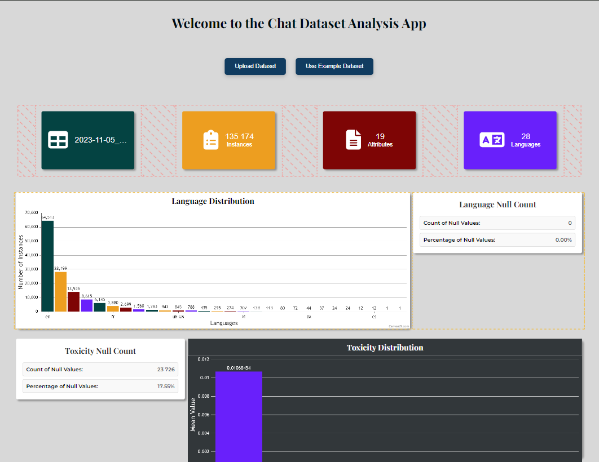
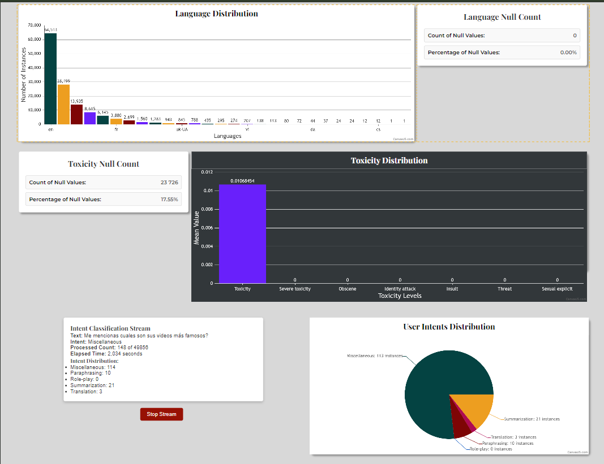

# Angular Chat Analysis 📊

Welcome to the **Angular Chat Analysis** project! This project was generated with [Angular CLI](https://github.com/angular/angular-cli) version 18.2.6. 🚀

---

## 📸 Screenshots

Here are some screenshots showcasing the application in action:

<div style="text-align: center;">
    
    <p><em>Onboarding Screen 1</em></p>
</div>

<div style="text-align: center;">
    
    <p><em>Onboarding Screen 2</em></p>
</div>

<div style="text-align: center;">
    
    <p><em>Dashboard</em></p>
</div>

<div style="text-align: center;">
    
    <p><em>Analysis View</em></p>
</div>

---

## 🚀 Features

- **Real-time Chat Analysis** 🗣️: Analyze chat interactions with dynamic insights.
- **User-friendly Dashboard** 📊: Intuitive dashboard for easy monitoring and reporting.
- **Modern UI** 🎨: Clean and responsive design, powered by Angular and CanvasJS.
- **Customization** 🛠️: Tailor-made visualizations and settings.

---

## 🛠️ Installation

To get started with the project, follow these steps:

1. Clone the repo:
   ```bash
   git clone https://github.com/your-username/angular-chat-analysis.git

