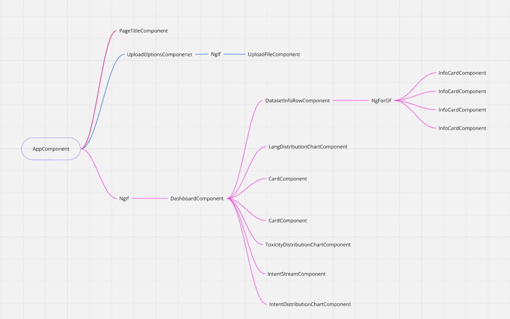

# Angular Chat Analysis 📊

Welcome to the **Angular Chat Analysis** project! This project was generated with [Angular CLI](https://github.com/angular/angular-cli) version 18.2.6. 🚀

---

## 📸 Screenshots

Here are some screenshots showcasing the application in action:

    
    
<em>Upload file </em>

    
    
<em>Dataset Info</em>

    
    
<em>Lang and Toxicity Distribution</em>

    
    
<em>User Intents real time classification</em>

---
## 🧩 Components Overview

    
    
<em>Components Hierarchy </em>

---

## 🚀 Features

- **Real-time Chat Analysis** 🗣️: Analyze chat interactions with dynamic insights.
- **User-friendly Dashboard** 📊: Intuitive dashboard for easy monitoring and reporting.
- **Modern UI** 🎨: Clean and responsive design, powered by Angular and CanvasJS.
- **Customization** 🛠️: Tailor-made visualizations and settings.

